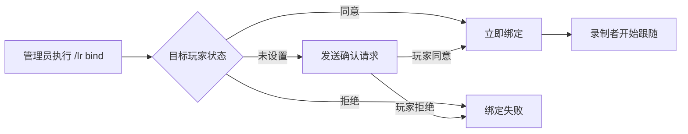
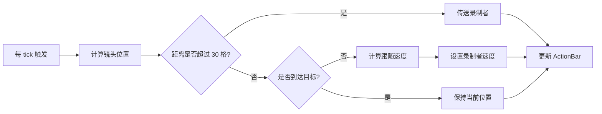
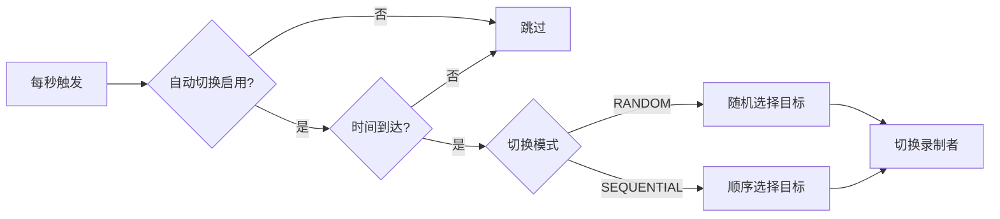

# 基本概念

在使用 LiveRecorder 之前，了解以下核心概念会有所帮助。

## 🎬 核心概念

### 录制者 (Recorder)

录制者是负责跟随拍摄的特殊玩家，具有以下特点：

- **位置自动控制**: 录制者的位置由插件自动控制
- **操作受限**: 不能打开背包、交互方块、攻击等
- **自动隐身**: 对其他玩家不可见，不影响游戏体验
- **ActionBar 提示**: 实时显示录制状态和目标信息

::: tip 录制者账号
建议使用专门的录制者账号，与玩家账号分离，方便管理。
:::

### 目标玩家 (Target)

目标玩家是被跟拍的玩家，具有以下特点：

- **正常游戏**: 不受任何影响，可以正常游戏
- **视觉提示**: ActionBar 显示正在被直播
- **发光效果**: 可选的高亮显示，方便识别
- **隐私控制**: 可以同意或拒绝被直播

### 绑定 (Binding)

绑定是指录制者与目标玩家之间的关联关系：

- **唯一性**: 一个录制者同一时间只能跟拍一个目标
- **持久性**: 绑定关系在服务器重启后保持
- **可切换**: 可以手动或自动切换目标

## 📐 镜头概念

### 镜头位置 (Camera Location)

镜头位置是录制者应该到达的位置，计算方式：

```
镜头位置 = 目标玩家位置 + 偏移量

水平偏移：
  dx = -distance × sin(yaw)      ← 目标身后
  dz =  distance × cos(yaw)

垂直偏移：
  dy =  distance × tan(pitch) + heightOffset
```

### 俯角 (Pitch)

俯角是镜头相对于水平线的角度：

| 俯角 | 效果 | 适用场景 |
|:----:|:-----|:---------|
| 0° | 平视 | 特写镜头 |
| 30° | 标准俯角 | 默认视角 |
| 60° | 鸟瞰 | 全景镜头 |
| 90° | 正上方 | 俯视镜头 |

### 水平距离 (Distance)

水平距离是镜头与目标玩家的水平距离：

| 距离 | 效果 | 适用场景 |
|:----:|:-----|:---------|
| 3.0 | 近距离 | 特写镜头 |
| 5.0 | 标准距离 | 默认视角 |
| 8.0 | 远距离 | 全景镜头 |

### 跟随速度 (Follow Speed)

跟随速度是录制者移动到镜头位置的速度系数：

| 速度 | 效果 | 适用场景 |
|:----:|:-----|:---------|
| 0.20 | 慢速平滑 | 平稳跟拍 |
| 0.35 | 标准速度 | 默认设置 |
| 0.50 | 快速跟随 | 运动镜头 |
| 0.70 | 紧密跟随 | 快速场景 |

## 🎮 绑定模式

### AUTO 模式（自动模式）

自动模式会按照预设规则自动切换目标：

```bash
/lr bind CameraMan Steve auto
```

**特点：**
- 按时间间隔自动切换
- 支持 RANDOM（随机）和 SEQUENTIAL（顺序）模式
- 适合综艺节目风格的轮播

### MANUAL 模式（手动模式）

手动模式需要管理员手动切换目标：

```bash
/lr bind CameraMan Steve manual
/lr switch CameraMan Alex
```

**特点：**
- 不会自动切换
- 完全由导播控制
- 适合单人直播跟拍

## 🔐 隐私概念

### 同意/拒绝机制

玩家可以控制自己是否可以被直播：

| 状态 | 说明 | 命令 |
|:----:|:-----|:-----|
| 同意 (ACCEPTED) | 可以被直播 | `/lr accept` |
| 拒绝 (DECLINED) | 不能被直播 | `/lr decline` |
| 未设置 (UNSET) | 需要确认 | 无 |

### 录制者隐身

录制者对其他玩家自动隐身：

- **其他玩家**: 看不到录制者
- **录制者**: 可以看到自己
- **目标玩家**: 看不到录制者

::: tip 隐身机制
隐身使用 Minecraft 的隐藏玩家机制，不影响游戏性能。
:::

### 直播日志

所有直播操作都会记录到数据库：

| 日志类型 | 说明 |
|:--------:|:-----|
| START | 开始跟拍 |
| END | 结束跟拍 |
| SWITCH | 切换目标 |
| ACCEPT | 同意直播 |
| DECLINE | 拒绝直播 |

## 🎨 视觉反馈

### 发光效果 (Glow)

目标玩家会高亮显示，颜色可自定义：

```yaml
visual:
  target-glow: true
  glow-color: YELLOW  # 可选颜色见配置文档
```

### ActionBar

ActionBar 实时显示录制状态：

| 角色 | ActionBar 内容 |
|:----:|:---------------|
| 录制者 | `LiveRecorder \| ● 跟随中 \| 目标: Steve \| 模式: 自动` |
| 目标玩家 | `🔴 您正在被直播 \| 1 位录制者跟拍中` |

### 粒子效果

镜头位置显示粒子标记（调试用）：

```yaml
visual:
  camera-particle: true
  particle-type: END_ROD
```

## 📊 数据结构

### RecorderBinding

录制者绑定数据结构：

```java
class RecorderBinding {
    UUID recorderUuid;      // 录制者 UUID
    Player recorder;        // 录制者实例
    UUID targetUuid;        // 目标 UUID
    Player target;          // 目标实例
    Mode mode;              // 绑定模式 (AUTO/MANUAL)
    boolean isActive;       // 是否活跃
    long bindTime;          // 绑定时间
}
```

### PrivacySetting

隐私设置数据结构：

```java
class PrivacySetting {
    UUID playerUuid;        // 玩家 UUID
    String playerName;      // 玩家名称
    ConsentStatus status;   // 同意状态 (ACCEPTED/DECLINED/UNSET)
    boolean invisible;      // 是否隐身
    long lastUpdated;       // 最后更新时间
}
```

### LiveLog

直播日志数据结构：

```java
class LiveLog {
    int id;                 // 日志 ID
    LogType type;           // 日志类型 (START/END/SWITCH/ACCEPT/DECLINE)
    UUID recorderUuid;      // 录制者 UUID
    String recorderName;    // 录制者名称
    UUID targetUuid;        // 目标 UUID
    String targetName;      // 目标名称
    long timestamp;         // 时间戳
}
```

## 🔄 工作流程

### 绑定流程



### 跟随流程



### 自动切换流程



## 📚 下一步

了解了基本概念后，可以继续学习：

- [命令参考](/commands/index) - 所有命令说明
- [配置详解](/config/index) - 完整配置说明
- [使用场景](/scenarios/index) - 实际应用案例

---

继续探索 LiveRecorder 的强大功能！🚀